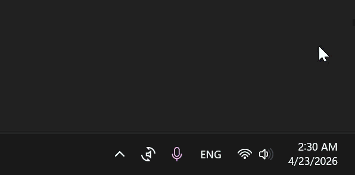
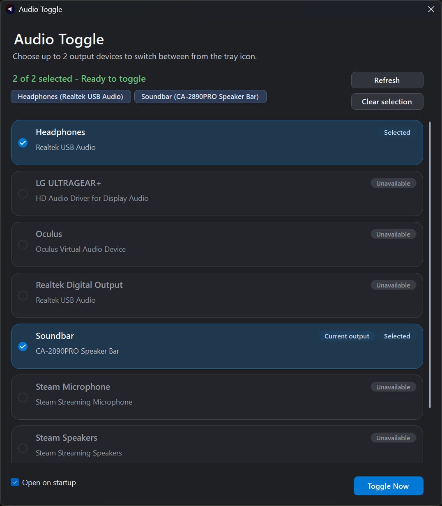
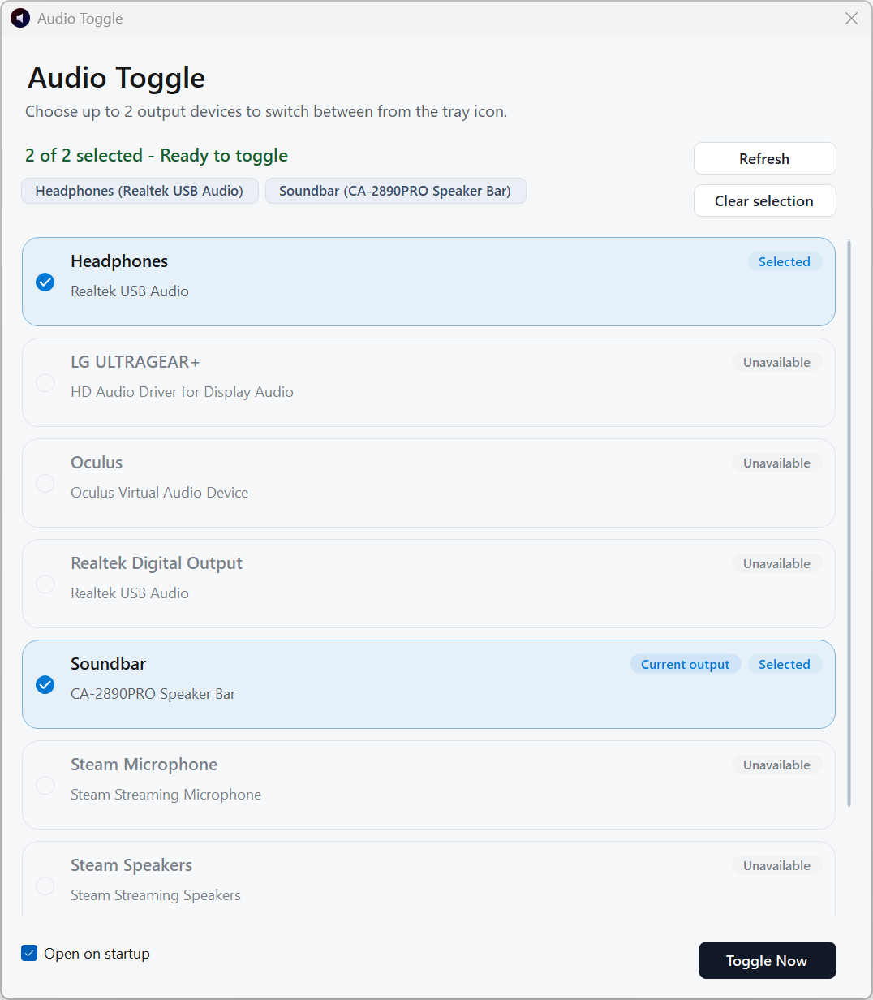
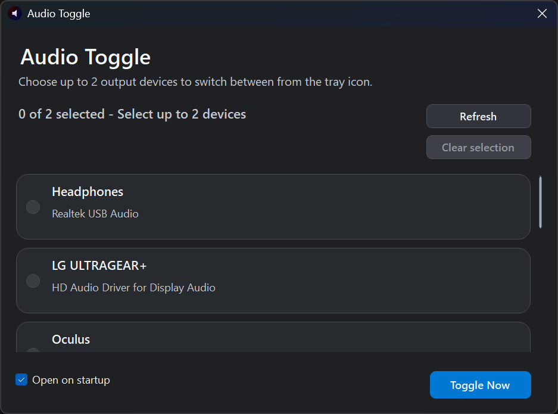
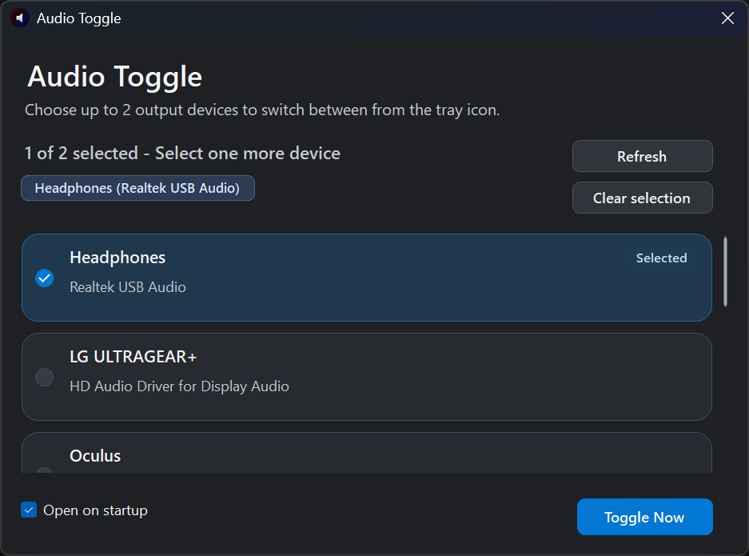
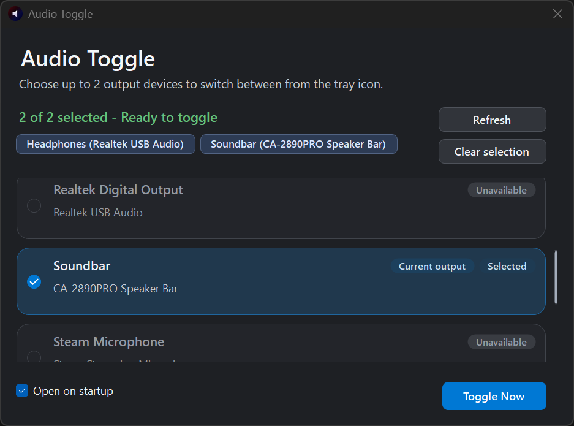
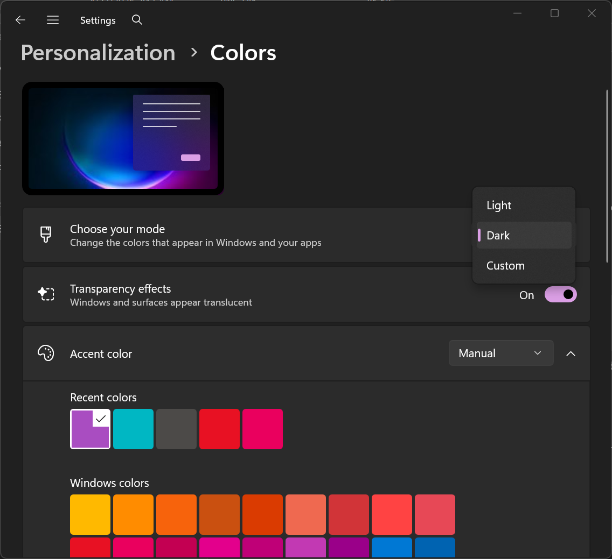

# Audio Toggle

A small Windows 11 tray app for switching between two audio output devices with one click.

Audio Toggle runs quietly in the notification area. Double-click the tray icon, or right-click it and choose `Open Settings`, to choose up to two playback devices. Single-click the tray icon whenever you want to switch output.

## Features

- Single-click tray icon toggle between two selected output devices.
- Double-click tray icon opens the settings window.
- Right-click tray menu includes `Open Settings`, `Toggle Output`, `Refresh Devices`, and `Exit`.
- Clean Windows 11 / Fluent-inspired UI.
- Follows the system light or dark theme.
- Shows active playback devices, selected devices, missing devices, and current output.
- Optional "Open on startup" checkbox.
- No admin privileges required.
- No registry editing for audio switching.
- Portable ZIP and lightweight installer release options.



## Interface

The settings window is intentionally simple: choose up to two output devices, refresh when a device is added, and toggle instantly for testing.



The app follows the Windows light or dark app theme.



## Download

Download from the latest GitHub Release:

- [AudioToggle-setup.exe](https://github.com/Tota1N00b/AudioToggle/releases/latest/download/AudioToggle-setup.exe) for a normal app install.
- [AudioToggle-portable.zip](https://github.com/Tota1N00b/AudioToggle/releases/latest/download/AudioToggle-portable.zip) for installer-free use.

If the links above do not work yet, open the repo's `Releases` page and download the latest `AudioToggle-setup.exe` or `AudioToggle-portable.zip`.

If you are building locally, generate both with:

```powershell
.\Installer\Build-Installer.ps1
```

The files will be created under:

```text
Installer\Output\
```

## Quick Start

1. Launch `AudioToggle.exe`.
2. Double-click the tray icon to open settings, or right-click it and choose `Open Settings`.
3. Select up to two output devices.
4. Single-click the tray icon to toggle between them.

## Setup Flow

Choose devices from a simple list. Selected devices are saved automatically.



Select one device.



Select a second device and you are ready to toggle.



To change the theme used by Audio Toggle, open Windows Settings and go to `Personalization` -> `Colors` -> `Choose your mode`.



## Build From Source

Requirements:

- Windows 11
- .NET 8 SDK or newer
- Inno Setup 6, only if you want to build the installer

Build the app:

```powershell
dotnet build AudioToggle.sln
```

Create a portable ZIP:

```powershell
.\Installer\Build-Portable.ps1
```

Create the installer:

```powershell
.\Installer\Build-Installer.ps1
```

## Notes

- Selected endpoint IDs are saved to `%AppData%\AudioToggle\config.json`.
- Portable builds self-register a Start Menu shortcut so Windows notifications can use the app icon.
- Default output is changed through Windows Core Audio / `IPolicyConfig` COM interop.
- The app sets the default output for Console, Multimedia, and Communications roles.
